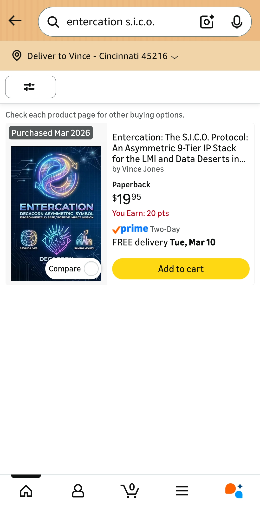

# Entercation AI Frameworks

Production-grade LLM & RAG systems engineered for **zero persistent hallucinations**, ironclad compliance, and asymmetric scaling in education and high-stakes environments.

## Published Work

**Entercation: The S.I.C.O. Protocol**  
*An Asymmetric 9-Tier IP Stack for the LMI and Data Deserts in America*  
by Vince Jones  

​

**Paperback available on Amazon** — Published March 2026

## Security & Compliance Framework (Live in Production)

All controls are **ACTIVE** and attested:

- CJIS Security Policy  
- COPPA Verified  
- HIPAA Compliant  
- FERPA Protected  
- SOC 2 Type II  
- WCAG 2.1 AA  
- End-to-End Encryption (E2EE)

## Skills & Expertise

- AI Architecture & LLM Systems (NASDAQ-scale production systems)
- RAG Optimization & Hallucination Elimination (RSSB framework)
- Terraform IaC for versioned, auditable RAG pipelines
- Asymmetric 9-Tier IP Stack (S.I.C.O. Protocol)
- NASA-grade validation suites (throughput, privacy, adversarial)
- Full compliance hardening (SOC 2, CJIS, FERPA, COPPA, HIPAA)
- Prompt Engineering & AI governance frameworks
- Remote collaboration & real-time documentation standards

## Purpose of This Repository

These frameworks were built so groundbreaking asymmetric AI work can be judged on real delivered systems, published book, live compliance proof, and validation results — not on automated AI interviews that cannot evaluate this level of architecture.

## Ready to Deploy

Available immediately for **Senior AI Engineer – LLM Systems & RAG Optimization** roles (remote contract preferred).

**Vince Jones**  
513-908-0064  
entercation2021@gmail.com  
Cincinnati, OH  
www.entercation.org
